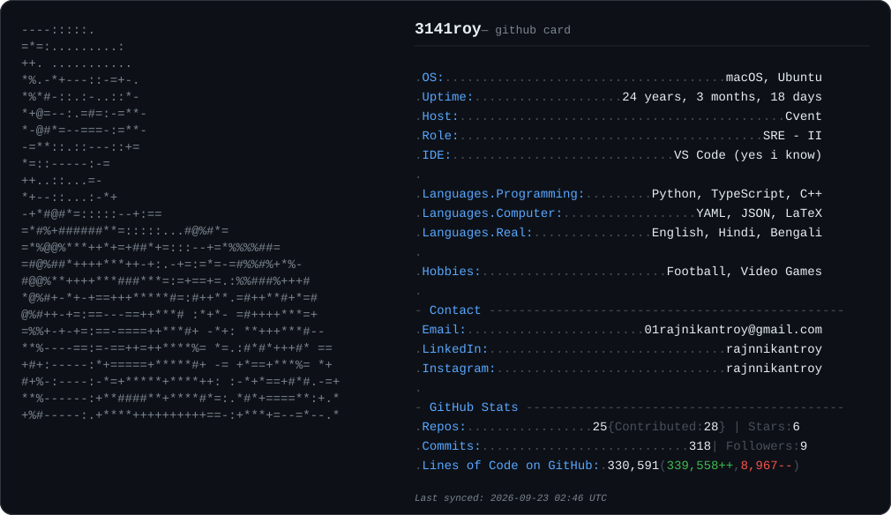

<picture>
  <source media="(prefers-color-scheme: dark)" srcset="dark_mode.svg">
  <source media="(prefers-color-scheme: light)" srcset="light_mode.svg">
  
</picture>

  

---

### About Me

- SRE-II at Cvent — five nines of uptime, considerably fewer nines of sleep.
- Handle's just π rounded to four digits, plus my name. No deeper story.
- Off the clock: video games first, football maybe never.

---

### 🛠️ Tech Stack

---

### 📫 Connect With Me

